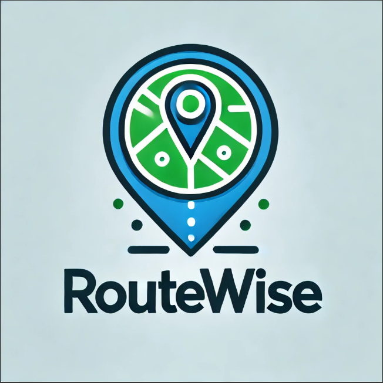

# RouteWise

<p align="left">
  
</p>

---

##  Demo

> 🌐 Check out the working demo here:  
[](https://youtu.be/rkEOCOGJcZY)

---

## 💡 What We DO!

- Take user input of **start** and **end** real-world locations  
- Fetch live data from **OpenStreetMap** using Overpass API  
- Calculate the **shortest path using A\*** algorithm 
- Display animated path on a dynamic **Leaflet.js map**  
- Show a loading animation while the route is being processed  

---

## ⚙️ Prerequisites

Before running RouteWise, ensure you have the following installed:

- Python 3.10 or above
- pip package manager
- Internet connection (for map and Overpass API)

## Installation

### 1. Clone the repository:
First, clone the repository to your local machine:

```bash
git clone https://github.com/jj1tofisial/DSA_proj.git
```

### 2. Enter the "Project" directory:
```bash
cd DSA_proj
```
### 3. Install Dependencies:
```
pip install -r requirements.txt
```
### 4. Run Application
```
python app.py

```
## Contributors
  This project was developed by the following team members:
 - **Aditya Rout** (Roll Number: B23PH1002)
 - **Amee Ghai** (Roll Number: B23PH1003)
 - **Anuj Trivedi** (Roll Number: B23CH1006)
 - **Kartik Jain** (Roll Number: B23ME1026)

